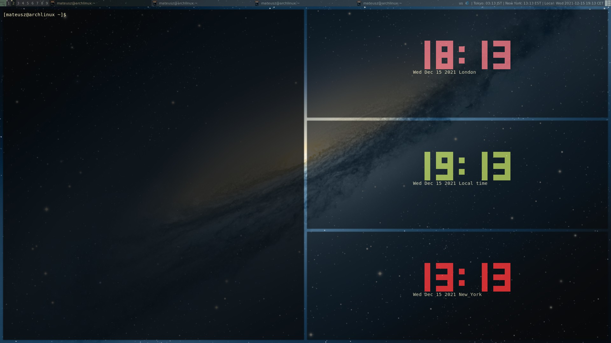

# ansiclock

Terminal clock writed in node inspired by tty-clock by Martin Duquesnoy <xorg62@gmail.com>.

# Installation
```bash
git clone https://github.com/matepak/ansiclock.git
npm install -g
```
# Usage
```bash
ansiclock #displays local time
ansiclock -t [city] #sets time zone for given city
ansiclock -m #sets clock in the middle of terminal
ansiclock -c [red|green|yellow|blue|magenta|cyan|white] #sets clock colour
```

eg.  
```bash
ansiclock -t Sydney -c red -m
```
To quit press 'q' key

